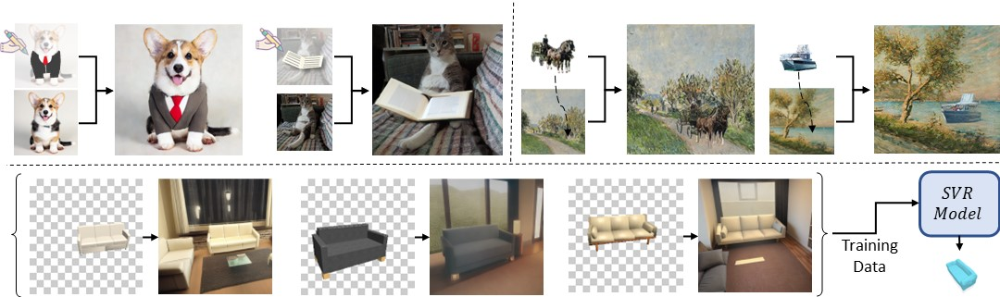
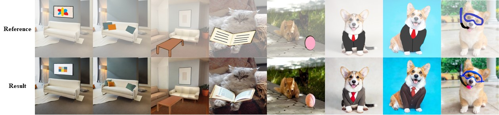
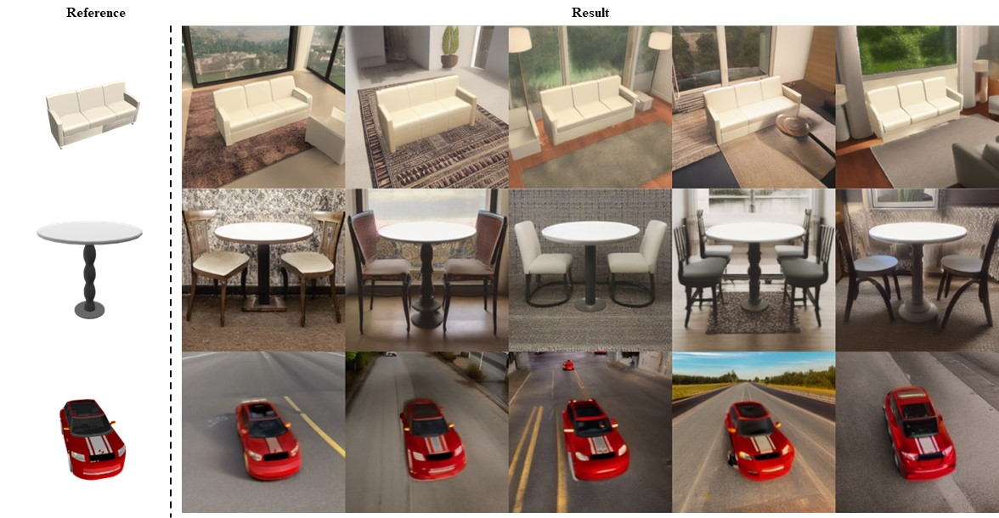
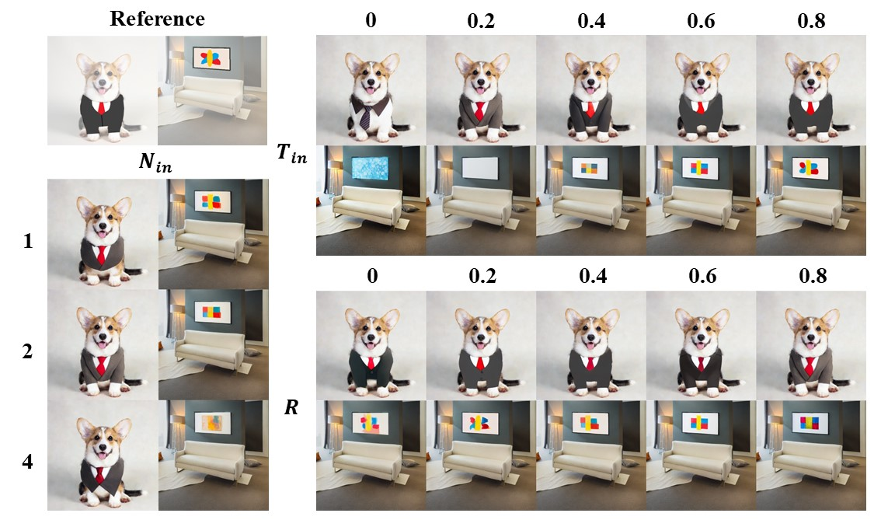

# Cross-domain Compositing with Pretrained Diffusion Models

[](https://arxiv.org/abs/2302.10167)

>**Abstract**: <br>
> Diffusion models have enabled high-quality, conditional image editing capabilities.
> We propose to expand their arsenal, and demonstrate that off-the-shelf diffusion models
> can be used for a wide range of cross-domain compositing tasks.
> Among numerous others, these include image blending, object immersion, texture-replacement and even CG2Real
> translation or stylization. We employ a localized, iterative refinement scheme which infuses the injected objects with
> contextual information derived from the background scene, and enables control over the degree and types of changes the
> object may undergo. We conduct a range of qualitative and quantitative comparisons to prior work, and exhibit that our
> method produces higher quality and realistic results without requiring any annotations or training. Finally, we
> demonstrate how our method may be used for data augmentation of downstream tasks.

This is the official implementation of Cross-domain Compositing (CDC), a local, inference-time, image editing method
which utilizes pretrained diffusion models for image compositing in various domains.  
We base our method on previous work in global image editing in inference-time, and propose a localized extension which
enables applications such as: guided image inpainting, cross-domain image compositing and object-guided Sim2Real.
The *fidelity-realism* tradeoff is controlled by our parameters.  



## Setup
This code builds on the [Stable Diffusion](https://github.com/CompVis/stable-diffusion) codebase.  
1. Clone the repo:
```
git clone --recursive https://github.com/cross-domain-compositing/cross-domain-compositing.git
cd cross-domain-compositing/
```
2. Create a new environment:
```
conda env create -f environment.yaml
conda activate ldm
```
**Or** install additional requirements to existing Stable Diffusion environment:  
```
conda activate ldm
conda install -c anaconda scikit-learn
conda install -c conda-forge h5py
conda install -c conda-forge plyfile
conda install -c conda-forge trimesh
conda install -c conda-forge natsort
pip install PyMCubes
```
Note that these are needed only if intended to run SVR.
3. Add submodules path and set PYTHONPATH to point to the root of the repository (we used [ResizeRight](https://github.com/assafshocher/ResizeRight.git) for image resizing):
```
export PYTHONPATH=$PYTHONPATH:$(pwd):$(pwd)/ResizeRight
```

4. Download pretrained Stable Diffusion checkpoints:
```
wget -P models/ldm/stable-diffusion-v1 https://huggingface.co/CompVis/stable-diffusion-v-1-4-original/resolve/main/sd-v1-4.ckpt
wget -P models/ldm/stable-diffusion-v1 https://huggingface.co/runwayml/stable-diffusion-inpainting/resolve/main/sd-v1-5-inpainting.ckpt
```
See [Stable Diffusion](https://github.com/CompVis/stable-diffusion) for more information on available model checkpoints.

## Usage

On top of the original img2img arguments (see [Stable Diffusion](https://github.com/CompVis/stable-diffusion)), we add the following for controlled levels
of local image editing:
- `--mask` - Path to mask or directory containing masks (1 is for FG, 0 is for BG).
- `--T_in` - Editing strength for inner region (1 in mask). 0 is for no conditioning at all, 1 for full guidance. Controls the amount of similarity to the reference image, using a high T allows for adding finer details to the reference at expense of similarity.
- `--T_out` - Editing strength for outer region (0 in mask). 0 is for no conditioning at all, 1 for full guidance. Controls the amount of similarity to the reference image, using a high T allows for adding finer details to the reference at expense of similarity.
- `--down_N_in` - Scaling (downsampling) factor for inner region (1 in mask). Has a similar effect to `T_in` but relates more to structure.
- `--down_N_in` - Scaling (downsampling) factor for outer region (0 in mask). Has a similar effect to `T_out` but relates more to structure.
- `--blend_pix` - Number of pixels for mask smoothing (see paper).
- `--repaint_start` - When to start resampling for increased receptive field (see paper). 0 is for no resampling, 1 to start from first step.
- `--mask_dilate` - Dilate mask by number of pixels.

We also implement Paint-By-Word from [eDiff-I](https://arxiv.org/abs/2211.01324) which enables localized text guidance to some degree, to use it:
- `--prompt_in/prompt_out` - Prompts for inner/outer regions (must appear in `--prompt`).
- `--prompt_amplifier_in/prompt_amplifier_out` - Prompt weight for inner/outer regions.

Our arguments are also sweepable! To do so simply supply multiple parameters to the desired arguments, and the script will sweep all permutations.
To define specific sets of sweeps use `--sweep_tuples`.
### Examples

#### Locally Guided Image Editing
```
python scripts_cdc/img2img.py --config configs/stable-diffusion/v1-inference.yaml --ckpt models/ldm/stable-diffusion-v1/sd-v1-4.ckpt --init_img examples/scribbles/images/ --mask examples/scribbles/masks/ --from_file examples/scribbles/prompts.txt --batch_size 1 --n_samples 1 --outdir outputs/scribbles --ddim_steps 50 --strength 1.0 --T_out 1.0 --T_in 0.0 0.2 0.4 0.6 0.8 --down_N_out 1 --down_N_in 1 2 4 --seed 42 --repaint_start 0 0.2 0.4 0.6 0.8 --skip_grid
```
You can also supply a config.yaml from a previous run:
```
python scripts_cdc/img2img.py --config [config]
```

#### Background augmentation

```
python scripts_cdc/img2img_inpaint.py --config configs/stable-diffusion/v1-inpainting-inference.yaml --ckpt models/ldm/stable-diffusion-v1/sd-v1-5-inpainting.ckpt --prompt "A photograph of a sofa in a living room" --init_img examples/sofas/images/ --mask examples/sofas/masks/ --n_samples 1 --outdir outputs/sofas --ddim_steps 50 --strength 1 --T_in 0 --T_out 0.5 --down_N_in 1 --down_N_out 1 --blend_pix 0 --seed 42 --repaint_start 0
```

### Single View 3D Reconstruction

We adopted [D^2IMNet](https://github.com/ManyiLi12345/D2IM-Net) for SVR model architecture, [DISN](https://github.com/Xharlie/DISN) data for training and [OccNet](https://github.com/autonomousvision/occupancy_networks) data for 3D evaluation. The model training/testing/preprocessing scripts are forked from  [D^2IMNet](https://github.com/ManyiLi12345/D2IM-Net).

#### Environment Configuration

We use [ChamferDistancePytorch](https://github.com/ThibaultGROUEIX/ChamferDistancePytorch.git) for chamfer distance evaluation.

```
git submodule add https://github.com/ThibaultGROUEIX/ChamferDistancePytorch.git
```

#### Data Preparation

1. Download and unzip rendered [image data](https://github.com/Xharlie/ShapenetRender_more_variation) and [GT ShapeNet SDF models](https://drive.google.com/file/d/1cHDickPLKLz3smQNpOGXD2W5mkXcy1nq/view?usp=sharing) from [DISN](<https://github.com/Xharlie/DISN>) to `./SVR/data/`
2. Preprocess image data by running scripts in `./SVR/preprocessing`
3. [Optional] Download processed ShapeNet data from [OccNet](https://github.com/autonomousvision/occupancy_networks/blob/master/scripts/download_data.sh) for 3D test result evaluation

#### Data Augmentation

Follow the steps below to perform background augmentation on the ShapeNet dataset.

1. Configure `./SVR/utils.py`. Specify ShapeNet category ID of interest, articulate on text prompt, choose camera views and set foreground conditioning strength.
2. `python ./SVR/augment_ShapeNet_data.py`. Change the save directory in the script if needed.

#### Training and testing

Follow the steps below to train D^2IMNet on the augmented dataset.

1. `python ./SVR/train_test_split.py` - Create train test split lst files.
2. Configure `./SVR/utils.py`. Specify the category of interest, the path to training images, and file names to save the trained model.
3. `python ./SVR/train/train.py` - Train SDFNet.
4. `python ./SVR/train/train_cam.py` - Train CamNet.
5. `python ./SVR/test/test.py` - Test on in-domain images.

#### Test on in-the-wild images

Follow the steps below to test and evaluate in-the-wild images.:

1. Source in-the-wild images and preprocess them to 224 x 224. Save the folder of test images to `./SVR/data`. Alternatively, we provide our processed sofa samples [here](https://drive.google.com/drive/folders/1Tp1ogEfZz9HmQakTTnSMrYWEgmC4oiYG?usp=sharing), please save them to `./SVR/data/sofa_samples`.
2. Run `python ./SVR/test/test_external_cam.py` and `python ./SVR/test/test_external_images.py` to get the predicted camera pose and 3D model. Remember to specify the input/output paths.
3. Run `python ./SVR/blender_render_trans_bg.py` to render the reconstructed model under the predicted camera pose. Remember to specify the input/output paths. We used blender 3.4.1 python API to run this script.
4. Extract the reference mask of the input images, we used [U^2Net](https://github.com/xuebinqin/U-2-Net). Save the folder of extracted reference masks in `./SVR/result`.
5. Run `python ./SVR/eval/eval_2D_iou.py` to evaluate 2D-IOU on in the wild images. Remember to specify the input/output paths.

## Results

#### Image Modification via Scribbles


#### Object Immersion in Paintings


#### Background Augmentation


#### Parameters Configuration Effects 


## Citation

If you use our work, please cite our [paper](https://arxiv.org/abs/2302.10167).
